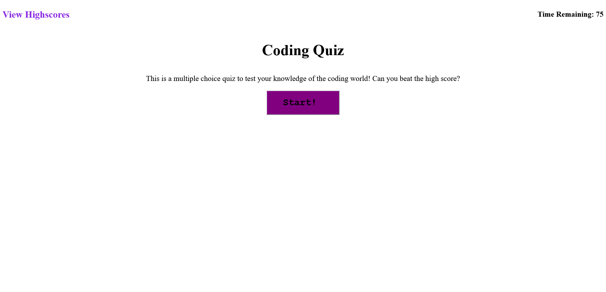
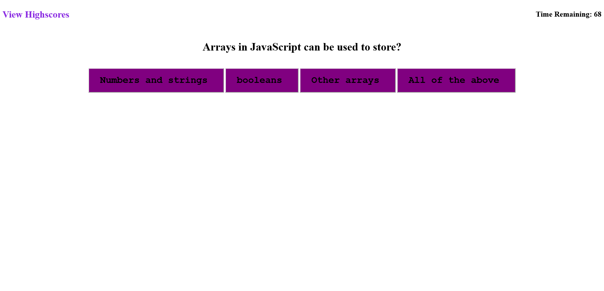
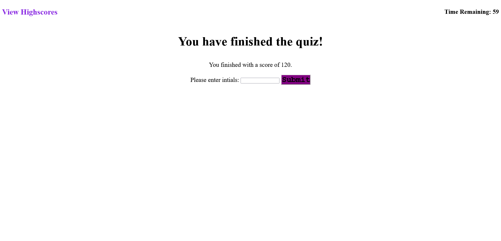

# Timed Coding Quiz

# Assignment to do list:
- [x] WHEN I click the start button THEN a timer starts and I am presented with a question
- [x] WHEN I answer a question THEN I am presented with another question
- [x] WHEN I answer a question incorrectly THEN time is subtracted from the clock
- [x] WHEN all questions are answered or the timer reaches 0 THEN the game is over
- [x] WHEN the game is over THEN I can save my initials and score

# Screenshots
# Start Page

# Question Page

# Submit Score Page

# Highscore Page

## GitHub Repository Link
https://github.com/Garendemirdogen/stunning-octo-memory.git
## Live URL Link
https://garendemirdogen.github.io/stunning-octo-memory/

Created by Garen Demirdogen 2022
